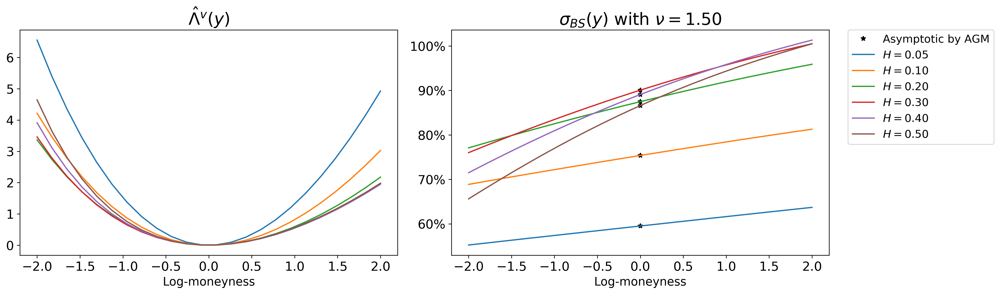

# LDP-VolOptions Large Deviations for volatility options

We implement the paper DAsymptotics for volatility derivatives in multi-factor rough volatility models available at: xxx.

We provide the code to compute the rate function for the mixed rough Bergomi model and produce pictures like the one below:

 
